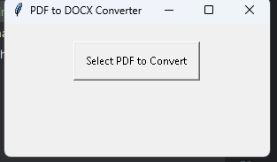

---
# 📄 PDF to DOCX Converter

Convert your PDF files to editable DOCX format effortlessly with this simple, intuitive Python application! Using `pdf2docx` and a `tkinter` interface, this tool makes document conversion fast and easy.

## 🌟 Features
- **User-friendly Interface**: Convert PDFs without needing technical skills.
- **Flexible Saving**: Choose where to save your converted DOCX files.
- **Multi-Page Support**: Convert all or selected pages.
- **Error-Free Conversion**: Reliable output with minimal formatting loss.

## 🚀 Quick Start

### Prerequisites
Ensure you have Python installed. You’ll also need to install dependencies using `pip`.

### Installation

1. **Clone the Repository**:
   ```bash
   git clone https://github.com/yourusername/pdf-to-docx-converter.git
   cd pdf-to-docx-converter
   ```

2. **Set Up the Environment**:
   ```bash
   python -m venv .venv
   source .venv/bin/activate  # On Windows use: .venv\Scripts\activate
   ```

3. **Install Required Packages**:
   ```bash
   pip install pdf2docx tkinter
   ```

### Run the Application

```bash
python main.py
```

This will open a graphical interface to select your PDF file and convert it to DOCX format.

## 🛠 Usage

1. **Click "Select PDF to Convert"** to browse and select a PDF file.
2. **Choose the Save Location** for the output DOCX file.
3. The tool will process the file and notify you upon completion.

## 📷 Screenshot

  <!-- Replace with an actual screenshot if available -->

## 📚 Project Structure

- `main.py`: Main file that runs the application and opens the GUI.
- `README.md`: Documentation to get you started.
- `.venv`: Virtual environment containing all dependencies.

## ✨ Technologies Used

- **Python**: Core programming language.
- **tkinter**: For GUI interface.
- **pdf2docx**: Conversion library to handle PDF to DOCX transformation.

## 🔥 Future Enhancements
- **Batch Conversion**: Select and convert multiple PDFs at once.
- **Additional Output Formats**: Option to convert to formats other than DOCX.

## 🤝 Contributing

Contributions are welcome! If you’d like to enhance this project, please fork the repository and make a pull request.

## 📄 License

This project is licensed under the MIT License. See `LICENSE` for more information.

---
